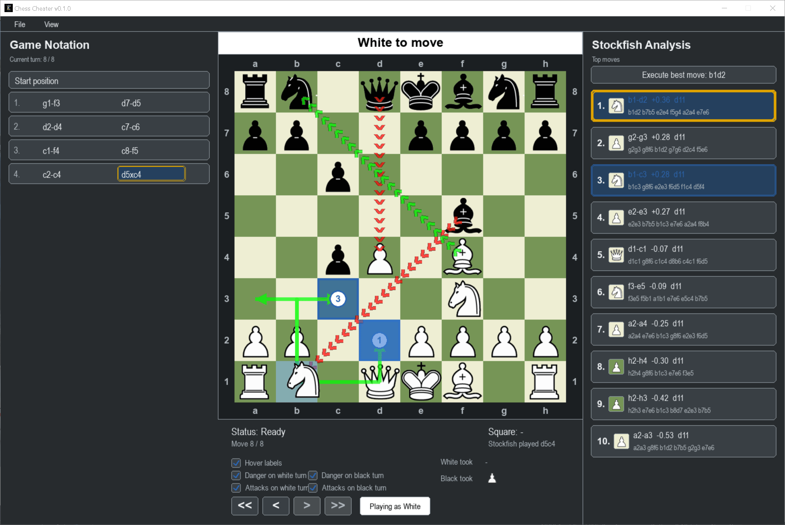

# Chess Cheater

Chess Cheater is a local chess study app for reviewing games, exploring openings, and learning from Stockfish analysis.

Despite the name, this is not meant to be used for cheating. Use it to analyze completed games, study opening ideas, practice board vision, and understand engine recommendations. Do not use it during live online games, rated games, tournaments, or anywhere engine assistance is against the rules.

If you use this to cheat and get banned on Chess.com, Lichess, your school club ladder, or anywhere else, that is on you. I am not responsible for your account, rating, reputation, lost trophies, or awkward conversations with fair-play support.



## What It Does

- Plays through games with rewind, forward, start, and end controls.
- Keeps future move history when rewinding, unless you make a new move.
- Shows captured pieces for each side.
- Labels board rows and columns.
- Shows square names on hover and with a Ctrl overlay.
- Flips the board between playing as White and playing as Black.
- Imports, exports, and pastes PGN-style games.
- Shows clickable game notation and highlights the current move.
- Uses Stockfish to show the top engine moves.
- Lets you preview Stockfish moves with animated board loops.
- Can execute a selected Stockfish move on the board.
- Includes Learn Opening mode, which matches the current line against bundled opening PGNs and shows which selected-piece moves keep you in the opening book.

## Running From Source

Requirements:

- Windows
- Python 3.12 or newer
- `pygame`
- Stockfish, either bundled in `engines/stockfish` or provided through `STOCKFISH_PATH`

Setup:

```powershell
python -m venv .venv
.\.venv\Scripts\Activate.ps1
python -m pip install pygame
python main.py
```

If Stockfish is somewhere else:

```powershell
$env:STOCKFISH_PATH = "C:\path\to\stockfish.exe"
python main.py
```

## Learn Opening Mode

Open `View > Learn opening mode`, then select a piece. The Stockfish column is replaced by an opening guide for that selected piece.

The guide compares the current game line against the PGNs in `openings/` and `openings/variations/`. If moving the selected piece can still lead to known openings, Chess Cheater draws green arrows to those squares, labels each destination with a numbered circle, and lists the matching openings in the right column.

## Building A Windows EXE

Yes, you can compile a Windows `.exe` for people to download from GitHub.

For this app, a folder-style PyInstaller build is recommended because it bundles images, PGNs, the icon, and the Stockfish files cleanly:

```powershell
.\.venv\Scripts\Activate.ps1
python -m pip install pyinstaller
python -m PyInstaller `
  --noconfirm `
  --clean `
  --windowed `
  --hidden-import tkinter `
  --hidden-import tkinter.filedialog `
  --name "Chess Cheater" `
  --icon "assets\chess_cheater_rook.ico" `
  --add-data "assets;assets" `
  --add-data "images;images" `
  --add-data "openings;openings" `
  --add-data "engines\stockfish\README.md;engines\stockfish" `
  --add-data "engines\stockfish\stockfish;engines\stockfish\stockfish" `
  --add-data "ChatGPT Image Jul 21, 2026, 02_19_24 PM.png;." `
  main.py
```

After the build finishes, zip this folder for a GitHub Release:

```text
dist\Chess Cheater\
```

People can unzip it and run:

```text
Chess Cheater.exe
```

If you distribute a build with Stockfish included, keep the Stockfish license and source files with it.

## Building A Debian/Ubuntu `.deb`

There is also a simple Debian package script. Build it on Debian, Ubuntu, or WSL, not from plain Windows PowerShell.

This `.deb` is source-based: it installs Chess Cheater under `/opt/chess-cheater` and runs it with system Python. It depends on Debian/Ubuntu packages for Python, Pygame, Tk file dialogs, and Stockfish.

```bash
sudo apt update
sudo apt install dpkg-dev python3 python3-pygame python3-tk stockfish
bash packaging/build_deb.sh 0.1.0
```

The package will be created here:

```text
dist/chess-cheater_0.1.0_all.deb
```

Install it locally with:

```bash
sudo apt install ./dist/chess-cheater_0.1.0_all.deb
```

Then run it from the app launcher or with:

```bash
chess-cheater
```

This Linux package does not bundle the Windows Stockfish executable. It uses the system `stockfish` package instead.

## Repository Layout

```text
main.py                 App UI, chess board, notation, Stockfish panel, opening mode
stockfish_engine.py     UCI wrapper used to talk to Stockfish
images/                 Chess piece images
assets/                 App icon
openings/               Bundled opening PGNs
engines/stockfish/      Bundled Stockfish release and GPL materials
packaging/              Linux launcher, desktop file, and .deb builder
screenshot.gif          Animated README demo
```

## License

Chess Cheater is licensed under the GNU General Public License version 3, the same license used by Stockfish.

Stockfish is a separate open-source project from the Stockfish developers and is also distributed under GPLv3. See `LICENSE`, `engines/stockfish/stockfish/Copying.txt`, and the official Stockfish repository:

https://github.com/official-stockfish/Stockfish
